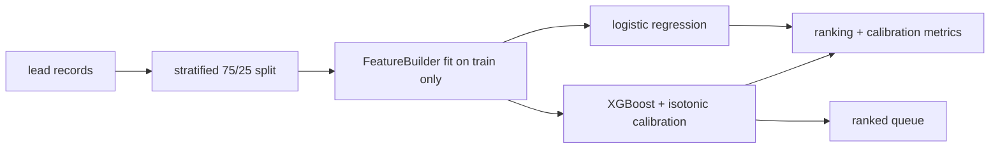

# lead-scorer — rank the inbound queue, don't classify it

[](https://github.com/darrshangovender/lead-scorer/actions/workflows/tests.yml)
[](LICENSE)
[](https://python.org)
[](https://scikit-learn.org)

> A B2B lead-scoring pipeline built around the metric sales actually cares about: whether the top decile of Monday's queue contains the deals that will close. Firmographic and behavioural features, an interpretable logistic-regression control, and an isotonically calibrated XGBoost scorer.

## Scope

This is a **public reference implementation**. The production version at the Agulhas Code client (under NDA) ingests live CRM and web-engagement data and pushes scores back into HubSpot on a schedule. The reference implementation here reproduces the same architecture — the same feature contract, the same two-model design, the same ranking metrics — over a synthetic lead generator anyone can re-run. Conversion impact from that engagement is not published.

**Why this exists.** Sales doesn't care whether a lead is "predicted to close" at over 50% probability. They care whether the fifty leads they call this week include most of the deals that will close. That is a ranking problem, and it dictates different metrics, a different loss surface, and different threshold choices from a yes/no classifier. Almost every lead-scoring writeup optimises accuracy and then wonders why the sales team ignores the number.

---

## Quick start

```bash
make install
make data        # generate a synthetic lead set
make train       # fit both models, write artifacts/metrics.json
make eval
```

```python
from lead_scorer import Scorer, FeatureBuilder
from lead_scorer.sample_generator import generate_leads

df = generate_leads(n=5000, seed=42)          # includes the binary `converted` target

scorer = Scorer(test_size=0.25, random_state=42)
report = scorer.train(df)
print(report.as_dict()["xgb"]["top_decile_precision"])
print(report.as_dict()["lr"]["roc_auc"])

ranked = scorer.score(df.drop(columns=["converted"]).head(200))
print(ranked[["lead_id", "score", "score_baseline"]].head())
```

`score` is the calibrated XGBoost probability; `score_baseline` is the logistic regression's, kept alongside deliberately — see Design decisions.

## How it works



1. Lead records arrive with firmographic and behavioural columns plus a binary target.
2. `Scorer.train` splits 75/25, stratified on conversion.
3. `FeatureBuilder.fit` validates required columns, rejects nulls, and locks the category vocabularies **on the training split only**.
4. `transform` hstacks scaled numerics with one-hot blocks against that locked vocabulary.
5. Both models fit the same matrix; XGBoost is wrapped in isotonic `CalibratedClassifierCV`.
6. `evaluate` computes ranking and calibration metrics on the held-out split.
7. `score` transforms new leads through the locked vocabulary and returns them sorted descending.

## What's modelled

| Feature | Kind | Signal |
|---|---|---|
| `industry`, `region`, `company_size` | one-hot | Firmographic fit |
| `seniority_score` | ordinal 1–7 | Is the contact able to sign? |
| `days_since_last_touch` | numeric | Recency |
| `email_engagement_score` | numeric [0,1] | Attention |
| `page_views_30d` | numeric | Intent volume |
| `demo_requested` | binary | The strongest single intent signal |

| Metric | Why it's here |
|---|---|
| `top_decile_precision` | The headline. Reps work a queue; this is the queue's density at the top. |
| `top_quintile_precision` | The same question one cut lower, for teams with more capacity |
| `roc_auc` / `pr_auc` | Standard ranking quality; PR-AUC matters because conversion is imbalanced |
| `brier_score` | Whether the probability means anything to someone about to act on it |

## Design decisions

| Decision | Why |
|---|---|
| **Two models, one shipped** | The logistic regression isn't the scorer. It exists so a sales manager asking "why is this lead an 87?" can be shown coefficients pointing the same way the box does. When the two disagree about direction, that's a data problem worth finding before it's a trust problem. |
| **Ranking metrics, not classification metrics** | Precision at the top decile is the number the business feels. Accuracy at a 0.5 threshold describes a decision nobody makes. |
| **Isotonic calibration** | Gradient-boosted probabilities are systematically overconfident. If a rep is going to escalate at "80% likely", 80% has to mean 80%. |
| **The feature builder locks its vocabulary at fit** | Scoring must use exactly the encoding training used. Re-deriving categories at score time is the classic silent skew. |
| **Synthetic data generator in the repo** | The pipeline runs end to end for anyone, with no client data and no download. The honest cost of that choice is the first limitation below. |

## Limitations

- **The labels are generated by a logistic formula the models then recover.** The sample generator builds the target as a fixed linear combination of exactly the features `FeatureBuilder` extracts, plus Gaussian noise. Any AUC or top-decile number from this repo measures GLM recovery on data with no missingness, no drift, and no unobserved confounders. It is a demonstration of the pipeline's mechanics, not evidence of lead-scoring performance. **All previously published performance figures have been removed from this README for that reason.**
- **The declared console script is broken.** `pyproject.toml` points `lead-scorer` at `run_from_csv`, which takes a required positional argument and does no argv parsing — argparse only exists under `__main__`. Running the installed command raises `TypeError`.
- **`run_from_csv` scores its own training data.** It calls `score_to_json` over the full frame, including the 75% the models were fit on, so the `scored_leads.json` that `make eval` produces is optimistically biased.
- **No imputation and no null tolerance.** The feature builder raises on any null in any required column. Real CRM exports have nulls in `days_since_last_touch` and `email_engagement_score` for every never-touched lead, so this cannot ingest raw client data as-is — imputation is explicitly the caller's problem.
- **Unseen categories fail silently.** A value outside the fitted vocabulary is zero-filled with no counter, warning, or drift metric. A renamed industry taxonomy degrades scores invisibly.
- **No model persistence.** Nothing serialises a fitted `Scorer` or `FeatureBuilder` — no joblib, no pickle, no ONNX. `score()` raises unless `train()` ran in the same process, so every scoring run is a full retrain.
- **There is no CRM integration, no API, and no warehouse.** `docs/crm-integration.md` sketches the HubSpot push pattern and says plainly that the repo stops short of it. `make notebook` also targets a notebook that does not exist.
- **NDCG and lift-over-random are not implemented**, despite being the natural companions to top-decile precision.

## Project layout

```
lead-scorer/
├── lead_scorer/
│   ├── pipeline.py          # Scorer · TrainReport · run_from_csv
│   ├── features.py          # FeatureBuilder: validate · one-hot · scale
│   ├── evaluation.py        # ranking + calibration metrics, calibration plot
│   ├── sample_generator.py  # synthetic lead generator
│   └── models/              # baseline_lr · xgb_ranker (isotonic-calibrated)
├── tests/                   # 20 tests
└── docs/                    # crm-integration · feature-engineering
```

## Tests

```bash
make test        # 20 tests
```

The suite pins the precision-at-k boundary cases (perfect, worst, random, rounding), asserts that isotonic calibration actually improves Brier over raw XGBoost, and checks that unseen categories encode to all-zero rows. CI runs it on every push.

## Author

Darrshan Govender · [Agulhas Code](https://agulhascode.co.za) · Durban, South Africa
